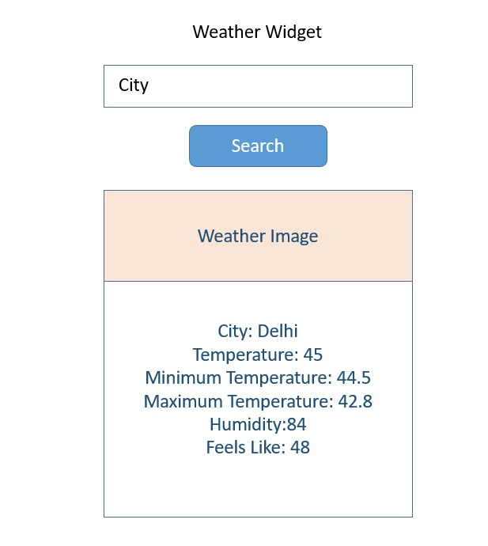

```markdown
# 🌦️ my_weather_app

A modern, responsive weather application built with **React.js** and styled using **Tailwind CSS**. The app fetches real-time weather data from the [OpenWeather Dashboard](https://dashboard.openweather.co.uk/) via its API, allowing users to search for and view current weather conditions for any city.

---

## ✨ Features

- 🔍 **City Search:** Instantly view current weather for any city worldwide.
- 🌡️ **Live Weather Data:** Real-time temperature, conditions, humidity, and wind.
- 🎨 **Responsive UI:** Clean, mobile-friendly interface with Tailwind CSS.
- ⚡ **Seamless API Integration:** Fetches accurate weather data from OpenWeather.
- 🛡️ **Error Handling:** Graceful handling of loading and error states.

---

## 🛠️ Tech Stack

- ⚛️ React.js (with Hooks)
- 💨 Tailwind CSS
- 🔗 Axios (for API requests)
- ☁️ OpenWeather API

---

## 🚀 Getting Started

### Prerequisites

- Node.js (v14 or higher)
- npm or yarn
- An API key from [OpenWeather Dashboard](https://dashboard.openweather.co.uk/)

### Installation

1. **Clone the repository**
   ```
   git clone https://github.com/ARPANkundu2404/my_weather_app.git
   cd my_weather_app
   ```

2. **Install dependencies**
   ```
   npm install
   ```

3. **Configure API Key**
   - Create a `.env` file in the root directory:
     ```
     VITE_API_KEY=your_openweather_api_key
     VITE_API_URL=https://api.openweathermap.org/data/2.5
     ```

4. **Start the application**
   ```
   npm start
   ```
   The app will run locally, typically at `http://localhost:3000`.

---

## 📁 Project Structure

```
my_weather_app/
├── public/
├── src/
│   ├── components/
│   ├── services/
│   ├── App.jsx
│   └── index.js
├── tailwind.config.js
├── postcss.config.js
├── .env
├── package.json
└── README.md
```

---

## 📦 Key Dependencies

| Package     | Purpose                    |
|-------------|----------------------------|
| react       | Frontend UI framework      |
| tailwindcss | Utility-first CSS framework|
| axios       | HTTP requests (API calls)  |

---

## 🎨 Customization

- **API Source:** Edit the API endpoint or key in your `.env` file as needed.
- **Styling:** Tweak Tailwind CSS settings in `tailwind.config.js` for your branding.

---

## 🖼️ Screenshot



---

## 👤 Author

Developed with ❤️ by [ARPANkundu2404](https://github.com/ARPANkundu2404)

---

## 📄 License

This project is licensed under the **ISC License**.

---

> _Contributions, suggestions, and improvements are always welcome!_
```

Citations:
[1] https://dashboard.openweather.co.uk
[2] https://dev.to/syawqy/build-a-weather-dashboard-your-first-api-project-with-react-4j7h
[3] https://github.com/syawqy/react-weather-dashboard
[4] https://rapidapi.com/blog/weather-app-react/
[5] https://www.youtube.com/watch?v=M_AIa5XD2YA
[6] https://www.reddit.com/r/reactjs/comments/1ger3hq/weather_app_in_react_with_tailwindcss_and/
[7] https://www.youtube.com/watch?v=-mC7jS0EplM
[8] https://github.com/topics/react-weather-app
[9] https://www.shecodes.io/athena/50-creating-a-react-component-with-the-openweather-api
[10] https://dev.to/ashutoshdash/making-weather-app-using-tailwind-css-using-openweathermaporg-in-javascript-4ifj
[11] https://www.youtube.com/watch?v=YxTkX_DDSGs

---
